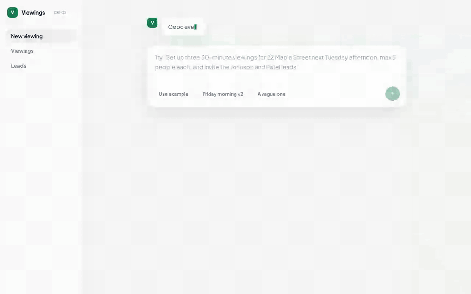

# Lette Viewings — AI-Powered Viewing Slot Invitations

A property manager describes viewings in plain English → the AI proposes structured slots
and personalised invitations → the admin reviews and approves → invitees book themselves
in, with capacity enforced and alternative times offered when a slot is full.

The design principle throughout: **the LLM proposes, a human approves, deterministic code
enforces.** Model output never reaches the database or an invitee without passing a schema
fence and a human gate. `DESIGN.md` has the reasoning; `PROCESS.md` logs how AI tooling
built it — including what it got wrong and how that was caught.



## Quick start

```bash
npm run setup     # installs workspaces + creates & seeds the SQLite database
npm run dev       # API on :4100 and web on :5173 together
npm test          # full suite (server + web) — runs WITHOUT any API key (LLM mocked)
```

For live AI features: `cp server/.env.example server/.env` and set `ANTHROPIC_API_KEY`.
Everything else — including the whole test suite — works with no key and no `.env`.

**No API key?** Put `LLM_MODE=mock` in `server/.env` to run the full UX against a
deterministic demo client: same validation fences, same streaming UI, and every message
is visibly labelled as demo output so it can't be mistaken for the real model.

## Try it

1. Open http://localhost:5173/admin
2. Use the example prompt (or type your own): *"Set up three 30-minute viewings for
   22 Maple Street next Tuesday afternoon, max 5 people each, and invite the Johnson and
   Patel leads"* — existing viewings can be managed the same way: *"cancel Tuesday's
   viewings at Maple Street"*, *"move the 5pm viewing to 7pm"* (bulk NL operations, one
   of the brief's bonus items; cancels and moves go through the same preview → confirm
   gate as creations)
3. Review the parsed preview → **Confirm & create**
4. **Draft invitations with AI** — messages stream in live, personalised from each lead's
   notes (Sarah asked about parking; Priya works evenings) — edit freely → **Approve & send**
5. Open a sent invitation's link to see the invitee view → **Accept**
6. To see the full-slot flow: create a slot with `max 1`, invite two leads, accept as
   both — the second gets alternative times instead of a dead end. Try *"some viewings
   next week sometime"* to see ambiguity handled with a question instead of a guess —
   answerable with one tap on an option chip or a typed reply, no retyping the request.

## Product decisions

The calls that shaped the admin experience — each deliberate:

- **"Conversational" = a light thread over a stateless parse, not a chat app.** The
  exchange builds visibly — the admin's request, the AI's clarifying questions, one-tap or
  typed answers — and the AI's closing turn answers with the actual plan ("Got it — three
  viewings at 22 Maple Street on Tuesday 21 July, inviting Sarah and Priya"). But the
  brief's required components (structured preview/confirm, review panel) stay full
  sections, never chat bubbles buried in scrollback, and there is no conversation state
  underneath: every answer is appended to one request string and re-parsed as a stateless
  single call, so the server sees exactly what the thread shows — and "edit the full
  request" collapses the exchange back into plain editable text at any point.
- **The AI shows its reading, in its own voice.** The model returns its judgement calls as
  spoken first-person sentences ("I read 'afternoon' as starting at 2pm. I used the default
  30-minute duration.") and they render inside its closing message, right above the
  structured preview they explain. Trust comes from being checkable, not from confidence.
- **Human review before anything is real.** Nothing is persisted at parse time; slots exist
  only after the admin confirms the preview, and no invitation is "sent" until its message
  is individually approved. LLM output never silently becomes state.

## Layout

| Path | What |
|---|---|
| `server/` | Express + TS + Prisma/SQLite. LLM fence, capacity logic, audit log. [README](server/README.md) |
| `web/` | Vite + React + Tailwind. Admin composer + invitee page. [README](web/README.md) |
| `shared/types.ts` | The API contract, imported by both sides |
| `DESIGN.md` | Architecture decisions and trade-offs, written before the code |
| `PROCESS.md` | How AI coding tools were used — the working rules, the day log, and what the AI got wrong |

## What was deliberately cut (Pareto), and what I'd do with more time

**Cut for scope, in the order I'd build them next:**

1. **Postgres + database-level capacity guarantee.** SQLite keeps setup at zero;
   the transactional re-count closes the race there (proven by a concurrent-accept test).
   Multi-instance production needs the check *in* the database — `SELECT ... FOR UPDATE`
   on the slot row, or a constraint/trigger that makes overfill impossible regardless of
   application bugs.
2. **Real invitee auth.** The invitation id doubles as the access link today (brief allows
   stubbed auth); real version is a signed, expiring token.
3. **Lead creation inside the flow.** An unknown invitee currently produces a question
   ("I couldn't find Bob — they may need to be added as a lead first"); the real version
   should offer to capture them on the spot ("give me an email and I'll add him"),
   because every unknown name is an acquisition opportunity, not an error. It's a new
   mutation surface, so it's cut and named. (Typos are already handled: "invite Pryia"
   asks "Did you mean Priya Patel?".)
4. **Smart defaults from history.** Learn per-property duration/capacity norms and feed
   them into the prompt as defaults; needs usage data to be meaningful.
5. **An eval harness.** `LlmCallLog` is already accumulating real inputs and outputs;
   replaying them against prompt changes turns prompt edits from guesswork into a
   regression suite. At real volume this is the first thing I'd build.
6. **Decline flow, lead management UI, pagination, rate limiting** — standard production
   furniture, wrong complexity for this stage.

**Known trade-offs accepted:** naive local times (Europe/Dublin assumed, no cross-timezone
handling) · single admin · drafts stream sequentially per lead (parallel streams are easy
but make the demo harder to follow) · SQLite test databases force sequential test files.
